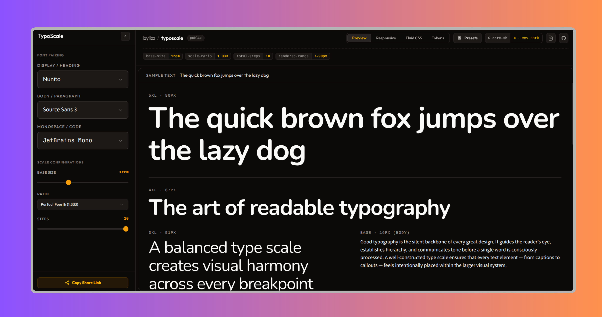

<p align="center">
  <a href="https://typoscale.vercel.app/">
    
  </a>
</p>

<h1 align="center">TypoScale</h1>

<p align="center">
  A modern, open-source type scale generator for designers and developers.
  Generate harmonious typography systems, pair Google Fonts, and export production-ready
  CSS & Tailwind tokens from one fast browser-based workspace.
</p>

<p align="center">
  
  
  
  
  
  
</p>

<p align="center">
  <a href="https://typoscale.vercel.app/">Live Demo</a> •
  <a href="https://github.com/byllzz/typoscale/issues/new">Report Bug</a> •
  <a href="https://github.com/byllzz/typoscale/issues/new">Request Feature</a>
</p>

---

# About

TypoScale is an open-source type scale generator built for designers and developers creating modern design systems.

Choose a base font size, select a modular ratio, pair Google Fonts, preview typography in real time, and export production-ready tokens for CSS, Tailwind CSS, or Style Dictionary.

Unlike traditional font calculators, TypoScale combines modular scaling, responsive typography, WCAG contrast checking, and live editorial previews into a single workflow.

Everything runs entirely inside your browser with no server-side processing or tracking.

---

# Features

- **Type Scale Generation** - Modular ratios, custom scales, independent steps, and instant px/rem conversion.
- **Font Pairing** - Browse 1000+ Google Fonts with dedicated Display, Body, and Monospace selectors.
- **Live Preview** - Responsive editorial preview with WCAG AA/AAA accessibility indicators.
- **Token Export** - Export typography tokens as CSS Variables, Tailwind CSS v3/v4, or Style Dictionary JSON.
- **Developer Experience** - Shareable URLs, dark & light themes, instant copy, and client-side processing.
- **Utilities** - Fluid `clamp()` generation, preset management, import/export, and session persistence.

---

# Architecture

TypoScale follows a simple principle:

> Every typography calculation should be deterministic, predictable, and completely independent from the user interface.

All typography calculations are handled by reusable utility functions while the React UI focuses solely on rendering and interaction. Global state is managed with **Zustand** and synchronized with URL query parameters, making every typography configuration easy to bookmark and share.

---

# Extending TypoScale

### Add a New Scale Ratio

Register a new ratio inside:

```text
src/types/scale.ts
```

```ts
newRatio: {
  label: "New Ratio",
  value: 1.618,
}
```

### Add a New Export Format

Implement a new generator inside:

```text
src/utils/tokenGenerators.ts
```

Once added, it automatically becomes available in the export panel.

---

# Project Structure

```text
typoscale/
├── public/
├── src/
│   ├── assets/
│   ├── components/
│   ├── hooks/
│   ├── store/
│   ├── types/
│   ├── utils/
│   ├── App.tsx
│   ├── main.tsx
│   └── index.css
├── package.json
├── vite.config.ts
└── tsconfig.json
```

---

# Directory Overview

- **components/** → Reusable UI components including controls, previews, font pickers, and token output.
- **hooks/** → Custom hooks for font loading, typography generation, clipboard, and shared logic.
- **utils/** → Pure functions for scale calculations, token generation, WCAG contrast, and fluid typography.
- **store/** → Zustand state management with URL synchronization and local persistence.
- **types/** → Shared TypeScript interfaces and application models.
- **assets/** → Preview images, icons, and static resources.

---

# Design Principles

TypoScale is built around a few core principles:

- **Deterministic Calculations** - Identical inputs always produce identical output.
- **Pure Functions** - Typography logic remains independent from the UI.
- **Client-Side First** - Everything runs locally without backend processing.
- **Shareable State** - URL parameters preserve and share configurations.
- **Reusable Components** - Modular React components encourage maintainability.
- **Data-Driven UI** - Scales and export formats are generated from shared configuration.

---

# Performance

TypoScale is optimized for responsive editing and instant feedback.

- Memoized scale generation using `useMemo`
- Debounced URL synchronization
- Shared font and ratio registries
- Local preference persistence
- Zero network requests during calculations

# Built With

TypoScale is built using a modern frontend stack focused on performance, maintainability, and developer experience.

- React
- Vite
- Tailwind CSS v4
- TypeScript
- Zustand
- Lucide React
- PrismJS
- Vercel

<p align="left">
  
</p>

---

# Getting Started

```bash
# Clone the repository
git clone https://github.com/byllzz/typoscale.git

# Enter the project
cd typoscale

# Install dependencies
npm install

# Start the development server
npm run dev
```

> **Optional:** Create a `.env.local` file and add `VITE_GOOGLE_FONTS_KEY` to access the complete Google Fonts library.

---

# Token Output

TypoScale generates production-ready typography tokens in multiple formats.

- CSS Custom Properties
- Tailwind CSS v3
- Tailwind CSS v4
- Style Dictionary JSON

### Example

```css
:root {
  --font-size-base: 1rem;
  --font-size-lg: 1.333rem;
  --font-size-xl: 1.777rem;
}
```

> Copy or download generated tokens and use them directly in your design system.

---

# Contributing

Contributions of every size are welcome.

```bash
git checkout -b feat/my-feature

npm run lint
npm run type-check
```

Please follow the Conventional Commits specification.

```text
feat: New feature
fix: Bug fix
docs: Documentation changes
refactor: Internal improvements
style: Formatting updates
chore: Maintenance tasks
```

After pushing your branch, open a Pull Request against `main`.

---

# Author


## Bilal Malik

[](https://github.com/byllzz)
[](https://x.com/bilalmlkdev)
[](https://bilalmlkdev.vercel.app)
[](https://www.linkedin.com/in/bilalmlkdev/)
[](mailto:bilalmlkdev@gmail.com)

If you enjoyed this project, consider giving it a ⭐ on GitHub. It helps others discover the project and motivates future improvements.

<p align="right">
  <a href="#texturae">⬆ Back to Top</a>
</p>

# License (MIT)

This project is licensed under the **MIT License**.

```text

MIT License

Copyright (c) 2026 Bilal Malik

Permission is hereby granted, free of charge, to any person obtaining a copy
of this software and associated documentation files (the "Software"), to deal
in the Software without restriction, including without limitation the rights
to use, copy, modify, merge, publish, distribute, sublicense, and/or sell copies
of the Software.The above copyright notice and this permission notice shall
be included in all copies or substantial portions of the Software.

THE SOFTWARE IS PROVIDED "AS IS", WITHOUT WARRANTY OF ANY KIND, EXPRESS OR
IMPLIED, INCLUDING BUT NOT LIMITED TO THE WARRANTIES OF MERCHANTABILITY,
FITNESS FOR A PARTICULAR PURPOSE AND NONINFRINGEMENT. IN NO EVENT SHALL THE
AUTHORS OR COPYRIGHT HOLDERS BE LIABLE FOR ANY CLAIM, DAMAGES OR OTHER
LIABILITY, WHETHER IN AN ACTION OF CONTRACT, TORT OR OTHERWISE, ARISING FROM
OUT OF OR IN CONNECTION WITH THE SOFTWARE OR THE USE OR OTHER DEALINGS IN THE
SOFTWARE.
```
© 2026 TypoScale. Licensed under the MIT License.
